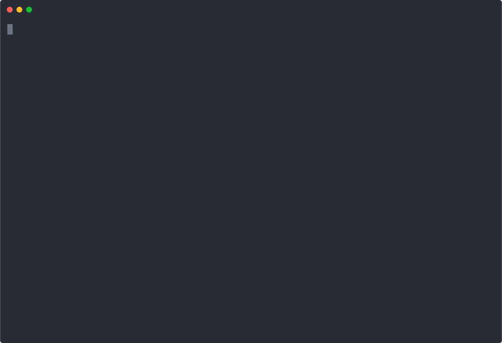

# loadam

> Point loadam at an OpenAPI spec. Get back a working **k6 load test**, a **Schemathesis contract suite**, and an **MCP server** for agents — in one command. OSS, Apache 2.0.

<p align="center">
 
</p>

```bash
npm i -g @loadam/cli          # or: npx @loadam/cli ...
loadam mcp ./openapi.yaml
# 8 files written → cd loadam-out/mcp && npm install && node bin.js
```

That's it. One spec → three production-grade rigs. **One engine, two surfaces:**

- **Test surface** — adversarial. Break the API: load, perf, contract drift.
- **Agent surface** — cooperative. Let LLM agents use the API safely via MCP (stdio + HTTP).

Both are compiled from the same **Intermediate Representation (IR)** built from your spec.

---

## Install

```bash
# Global install — gives you the `loadam` binary on $PATH:
npm i -g @loadam/cli

# Or run on demand without installing:
npx @loadam/cli <command>

# Or pin per-project:
npm i -D @loadam/cli && npx loadam <command>
```

Once installed globally, all examples below work as `loadam <command>` (no `npx` prefix).
Requires Node.js 20+. The generated rigs have their own runtime requirements: **k6** for load tests, **Python 3.10+** for contract tests, **Node.js 20+** for the MCP server.

## 30-second quickstart

```bash
# 1. Inspect what loadam sees in your spec.
loadam init ./openapi.yaml

# 2. Generate a runnable k6 smoke + load test.
loadam test ./openapi.yaml --target https://api.example.com
cd loadam-out/k6 && cp .env.example .env && k6 run smoke.js

# 3. Generate a property-based Schemathesis contract suite.
loadam contract ./openapi.yaml --target https://api.example.com
cd loadam-out/contract && pip install -e . && pytest

# 4. Generate an MCP server. Read-only by default.
loadam mcp ./openapi.yaml
cd loadam-out/mcp && npm install && node bin.js          # stdio (Claude Desktop)
node bin.js --http                                       # streamable HTTP

# 5. Detect drift between spec and live API.
loadam diff ./openapi.yaml --target https://api.example.com -o drift.md
```

Every command supports `--json` for CI:

```bash
loadam mcp ./openapi.yaml --json | jq .toolNames
```

## Commands

| Command                  | What it does                                                | Output                 |
| ------------------------ | ----------------------------------------------------------- | ---------------------- |
| `loadam init <spec>`     | Parse spec → IR with inferred resource graph                | `loadam.ir.json`       |
| `loadam test <spec>`     | Compile to k6 smoke + load scripts (stateful, ID-threading) | `loadam-out/k6/`       |
| `loadam contract <spec>` | Compile to a Schemathesis pytest project                    | `loadam-out/contract/` |
| `loadam mcp <spec>`      | Compile to a runnable MCP server (stdio + HTTP)             | `loadam-out/mcp/`      |
| `loadam diff <spec>`     | Probe a live API and report spec-vs-reality drift           | Markdown               |
| `loadam auth import`     | Infer an auth profile from a `curl` command                 | JSON / pretty          |
| `loadam update`          | Check npm for a newer version of `@loadam/cli`              | text or `--json`       |
| `loadam completion`      | Print bash/zsh/fish completion script                       | stdout                 |

## What you get from `loadam mcp`

- A self-contained npm project (8 files, ESM JS, no build step required).
- One MCP tool per safe HTTP operation. **Read-only by default;** opt in with `--writes`.
- stdio transport (Claude Desktop, Cursor) and Streamable HTTP transport on the same binary.
- Auth read from environment variables — secrets are **never** inlined into generated code.
- Path-param substitution, JSON body marshalling, response framing as MCP tool content.

```jsonc
// Drop into ~/Library/Application Support/Claude/claude_desktop_config.json:
{
 "mcpServers": {
  "petstore": {
   "command": "node",
   "args": ["/abs/path/to/loadam-out/mcp/bin.js"],
   "env": { "BASE_URL": "https://petstore.swagger.io/v1", "X_API_KEY": "..." },
  },
 },
}
```

## Why loadam

Most teams have an OpenAPI spec sitting in a repo and **none** of the rigs that should fall out of it. They wire each one by hand, badly, and then drift. Loadam treats the spec as the source of truth and emits everything once: load, contract, drift, agent. One shape of input, four shapes of output, zero hand-rolled boilerplate.

## Privacy & telemetry

**Zero telemetry.** No analytics, no crash reporting, no phone-home. The CLI only makes network requests when you explicitly run `loadam diff --target <url>`. Generated rigs talk only to whatever target you configure. See [SECURITY.md](SECURITY.md) for the full guarantee.

## Shell completion

```bash
loadam completion bash > ~/.loadam-completion.bash && echo 'source ~/.loadam-completion.bash' >> ~/.bashrc
loadam completion zsh  > "${fpath[1]}/_loadam"          # then restart shell
loadam completion fish > ~/.config/fish/completions/loadam.fish
```

## Project layout

```
packages/
  core/          IR (Zod schemas) + OpenAPI adapter
  graph/         Resource graph inference (Pet → Order → User)
  data/          Stateful faker (json-schema-faker + registry overlay)
  auth/          Profile types + curl tokenizer
  test-k6/       k6 compiler — emits smoke.js + load.js + fixtures
  test-contract/ Schemathesis compiler — emits pytest project
  test-drift/    Live probe + Markdown diff report
  mcp/           MCP compiler — emits stdio + HTTP server
  cli/           commander-based CLI tying it all together
```

## Status

V1 (this) targets **petstore-class specs** end-to-end. Stripe-class specs (polymorphism, discriminators, recursive $refs) graduate in V1.1.

|                           | V1                    | V1.1                         |
| ------------------------- | --------------------- | ---------------------------- |
| OpenAPI 3.x               | ✅                    |                              |
| Postman / HAR / curl      | curl only             | Postman + HAR                |
| k6 smoke + load           | ✅                    |                              |
| Schemathesis contract     | ✅                    |                              |
| Drift report              | ✅                    |                              |
| MCP server (stdio + HTTP) | ✅ read-only default  | per-op `--writes` opt-in     |
| Auth                      | bearer, apiKey, basic | OAuth2 PKCE, AWS sigv4, mTLS |
| Spec scale                | ~10 ops               | ~600 ops + polymorphism      |

## Examples

- [examples/basic-openapi](examples/basic-openapi/) — petstore, no auth required to generate
- [examples/with-auth](examples/with-auth/) — bookstore with bearer auth + multi-server

## Development

```bash
pnpm install
pnpm -r build
pnpm -r test
```

Conventions:

- TypeScript strict + ESM; Node 20+; pnpm 9.15+.
- Biome for formatting (1-space indent, single quotes). Run `pnpm fix`.
- Vitest for tests. Every package ships with goldens against the petstore fixture.

## Documentation

- [CHANGELOG](CHANGELOG.md)
- [CONTRIBUTING](CONTRIBUTING.md)
- [SECURITY](SECURITY.md)

## License

Apache 2.0. Permissive on purpose — the value is the IR + scenario synthesis, not the runner.
